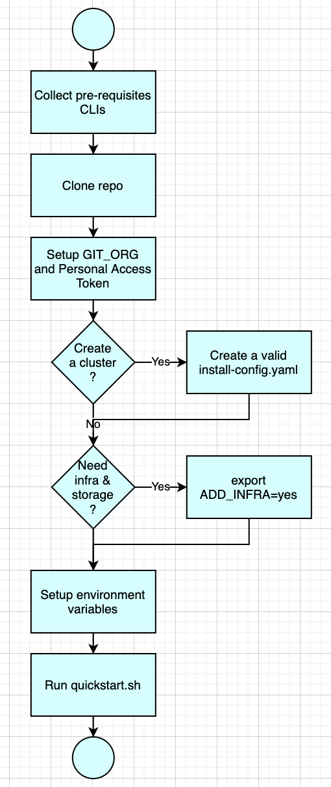

# IBM Cloud Pak - QuickStart script collection

This repository collects invocation scripts for setting up OpenShift cluster for a Quick Start scenario in the Production Deployment Guide. 

For more information on Production Deployment Guide, see [https://pages.github.ibm.com/cloudpakbringup/production-deployment-guides/](https://pages.github.ibm.com/cloudpakbringup/production-deployment-guides/). 

## How to use this repository



These are the pre-requisites:

- Provided bash environment
- Install the [Github CLI](https://github.com/cli/cli) (version 1.14.0+)
- Install the [Git CLI](https://git-scm.com/book/en/v2/Getting-Started-Installing-Git)
- Install the [OpenShift CLI](https://access.redhat.com/downloads/content/290) - `oc` (version 4.7 or 4.8) and `openshift-install` 
- Install the [kubeseal CLI](https://github.com/bitnami-labs/sealed-secrets#homebrew) 
- Install the [Tekton CLI](https://tekton.dev/docs/cli/)
- Install the [ArgoCD CLI](https://argoproj.github.io/argo-cd/cli_installation/)
- Access to a newly installed cluster or sufficient access to a platfor to setup a new OpenShift cluster
- Setup a [sealed secret certificate](https://github.com/bitnami-labs/sealed-secrets/blob/main/docs/bring-your-own-certificates.md) 

GIT Personal Access Token and GitHub Organization instruction can be read at [Personal Access Token](https://pages.github.ibm.com/cloudpakbringup/production-deployment-guides/snippets/gitops-cluster-prereq/#create-a-git-personal-access-token-pat) and [GitHub Organization](https://pages.github.ibm.com/cloudpakbringup/production-deployment-guides/snippets/gitops-cluster-prereq/#create-a-custom-git-organization).

Before running the installer setup the necessary environment variables:

```bash
export SOURCE_DIR="/path-to-setup-dir"
export GITHUB_TOKEN="ghp_nnnnnnnnnnnnnnnnnnnnn" 
export GIT_USER="gituser"
export GIT_TOKEN="ghp_nnnnnnnnnnnnnnnnnnnnn" 
export GIT_ORG="git_organization"
export SEALED_SECRET_KEY_FILE=./ss.yaml
export OUTPUT_DIR="gitops"
export RWX_STORAGECLASS="ocs-storagecluster-cephfs"
export IBM_ENTITLEMENT_KEY="xxxxxxxxxxxxxxxxxx"
## component switches
export ADD_INFRA="yes"
export ADD_MQ="yes"
export ADD_MQAPPS="yes" 
export ADD_ACE="yes"
export ADD_ACEAPPS="yes"
```

Run the quickstart program

``` bash
git clone https://github.com/vbudi000/cloudpak-quickstart
mkdir path-to-setup-dir
cd path-to-setup-dir
../cloudpak-quickstart/scripts/quickstart.sh
```
